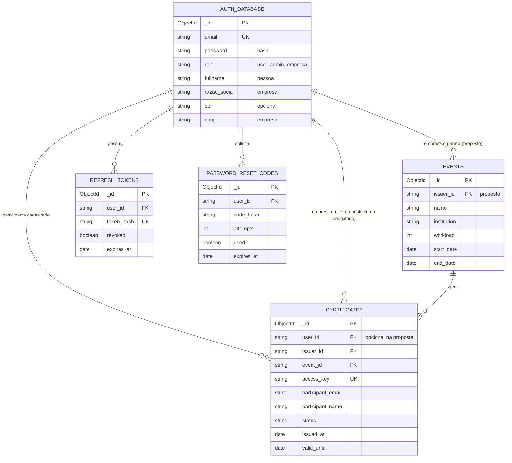

# Modelagem do banco de dados — Certify

Modelagem baseada nos modelos, repositórios e serviços da API em 05/10/2026. Banco: MongoDB, com nome definido por `DB_NAME`. Esta documentação descreve o código e propõe uma evolução; não aplica alterações ao banco.

## 1. Modelo conceitual proposto

Uma conta representa um aluno, administrador ou empresa. Uma empresa organiza eventos e emite certificados. Cada certificado registra um participante e um evento, preservando os dados utilizados na emissão. O participante pode não ter conta. Sessões e códigos de recuperação pertencem a contas.



O diagrama representa o destino proposto. `PK`, `FK` e `UK` indicam identidade, referência lógica e unicidade desejada. MongoDB não verifica automaticamente referências entre coleções. No código atual não há criação explícita dos índices únicos indicados.

## 2. Modelo físico atual

Os `_id` são BSON ObjectId. Referências são strings contendo o ID; a API converte `_id` para string nas respostas. Datas persistidas são BSON Date; usar UTC na escrita e configurar leitura compatível com UTC. Campo opcional pode estar ausente ou ter valor `null`, conforme a origem da gravação.

### `auth_database` — contas e empresas

| Campo | Tipo persistido | Regra/uso atual |
|---|---|---|
| `_id` | ObjectId | Identificador da conta |
| `email` | string | Login; duplicidade verificada pela aplicação |
| `password` | string | Hash de senha; não retornar ao cliente |
| `role` | string | `user`, `admin` ou `empresa` |
| `fullname` | string | Nome da pessoa; obrigatório no cadastro de usuário |
| `razao_social` | string | Obrigatório no cadastro específico de empresa |
| `cpf` | string/null | Opcional no modelo de usuário |
| `cnpj` | string/null | Obrigatório e validado no cadastro específico de empresa |
| `organization_name` | string/null | Nome de organização no cadastro de usuário; alias de entrada `organizationName` |
| `occupation` | string/null | Profissão/cargo |
| `phone` | string/null | Telefone |
| `status` | string | Criado como `pending`; alterado para `available` na emissão |
| `created_at` | Date | Criação |
| `updated_at` | Date | Última alteração |

O modelo genérico também aceita `cnpj` e papel `empresa`; as exigências do fluxo específico de empresa não são, por isso, garantidas globalmente pelo esquema do banco.

Há métodos antigos de recuperação que usam `password_reset_code`, `password_reset_expires_at` e `password_reset_used` na conta. As definições posteriores dos mesmos métodos sobrescrevem as anteriores e usam a coleção separada. Tratar esses campos como legado, não como parte do modelo novo.

### `events` — eventos/cursos

| Campo | Tipo | Regra/uso atual |
|---|---|---|
| `_id` | ObjectId | Identificador |
| `name` | string | Nome, entre 5 e 200 caracteres na entrada |
| `institution` | string | Nome da instituição; não é referência à empresa |
| `workload` | int | Horas, maior que zero |
| `description` | string | Descrição |
| `start_date` | Date | Início |
| `end_date` | Date | Fim, igual ou posterior ao início |
| `created_at` | Date | Criação |
| `updated_at` | Date | Gravado quando há atualização; não exposto no modelo `EventInDb` atual |

Atualmente não existe `issuer_id` no evento. O serviço impede excluir evento com certificados, mas isso é uma verificação na aplicação.

### `certificates` — certificados emitidos

| Campo | Tipo | Regra/uso atual |
|---|---|---|
| `_id` | ObjectId | Identificador |
| `user_id` | string | ID da conta ou `guest:<email>` na emissão em lote |
| `issuer_id` | string | Opcional no modelo/repositório; não é efetivamente passado pelos serviços de emissão atuais |
| `event_id` | string | Referência ao evento; o serviço verifica sua existência |
| `access_key` | string | UUID gerado na emissão para consulta pública |
| `status` | string | Modelo aceita `pending`, `available`, `expired`; emissão grava `available` |
| `participant_name` | string | Nome registrado na emissão |
| `participant_email` | string | E-mail registrado na emissão |
| `institution_name` | string | Cópia do nome da instituição |
| `event_name` | string | Cópia do nome do evento |
| `description` | string | Cópia da descrição |
| `workload` | string | Cópia da carga horária; diferente do `int` de eventos |
| `event_start` | Date/null | Cópia do início |
| `event_end` | Date/null | Cópia do fim |
| `event_date` | Date/null | Atualmente repete o início |
| `issued_at` | Date/null | Emissão; gravada na criação |
| `valid_until` | Date | Atualmente dois anos após emissão |

Os campos copiados constituem um retrato do momento da emissão. Atualizar um evento ou uma conta não deve reescrever automaticamente o histórico de certificados.

`ACCESS_KEY` do ambiente autoriza a emissão no repositório; é diferente do `access_key` individual persistido no certificado.

### `refresh_tokens` — sessões

| Campo | Tipo | Regra/uso atual |
|---|---|---|
| `_id` | ObjectId | Identificador |
| `user_id` | string | Referência à conta |
| `token_hash` | string | SHA-256 do token; token original não é persistido |
| `created_at` | Date | Criação |
| `expires_at` | Date | Expiração |
| `revoked` | boolean | Revogação; começa `false` |

O repositório tenta limitar a cinco tokens não revogados por conta, revogando os mais antigos. O limite não é atômico sob concorrência e a contagem inclui tokens vencidos ainda não revogados.

### `password_reset_codes` — recuperação de senha

| Campo | Tipo | Regra/uso atual |
|---|---|---|
| `_id` | ObjectId | Identificador |
| `user_id` | string | Referência à conta |
| `code_hash` | string | Hash do código |
| `created_at` | Date | Criação |
| `expires_at` | Date | Expiração |
| `attempts` | int | Inicia em zero; limite de três tentativas |
| `used` | boolean | Inicia `false`; também indica invalidação |
| `invalidated_at` | Date | Opcional; momento da invalidação |
| `reason` | string | Opcional; `replaced`, `max_attempts` ou `reset` |

Novo código invalida os códigos não utilizados e ainda válidos da conta. Isso ocorre em operações separadas, sem garantia de exclusividade sob concorrência.

Uploads de logos e assinaturas são arquivos em `uploads/`; não há coleção de arquivos nem persistência de metadados no serviço de upload analisado.

## 3. Evolução recomendada

Manter as cinco coleções para evitar uma migração desnecessária de nomes. Não criar uma coleção separada de empresas enquanto cada empresa corresponder a uma única conta. Se houver vários colaboradores por empresa, introduzir `organizations` e vínculos de membros em uma evolução específica.

| Aspecto | Decisão proposta | Alterações necessárias |
|---|---|---|
| Identificadores | Manter `_id` ObjectId e referências string de 24 dígitos hexadecimais | Validar referências nos serviços e no esquema; não aceitar IDs fictícios como referências |
| Participante sem conta | `user_id: null`, mantendo nome e e-mail obrigatórios | Alterar modelo, emissão em lote e vínculo posterior; migrar `guest:<email>` |
| Empresa responsável | `events.issuer_id` e `certificates.issuer_id` obrigatórios para novos registros | Obter ID da identidade autenticada; validar papel e propriedade do evento; corrigir passagem de argumento nos serviços |
| E-mail | Normalizar com `strip().lower()` em todos os fluxos | Cadastro, login, atualização e emissão devem usar a mesma representação |
| Documentos | CPF/CNPJ como strings normalizadas; omitir ausentes | Validar conforme tipo de conta e evitar strings vazias |
| Status do certificado | Padronizar `pending`, `available`, `expired`, `inactive` | Alinhar enum, serviço, respostas e consultas; hoje o serviço grava `inactive`, que o modelo não aceita |
| Validade pública | Exigir `status == available` e `valid_until > agora` | Hoje a consulta também aceita `pending` e não verifica a validade temporal |
| Carga horária | Preservar string em certificados nesta etapa | Uma futura mudança para número exige adaptar contrato da API e frontend |
| Datas | UTC consistente; `updated_at` nos eventos e certificados | Alinhar persistência, leitura e modelos de resposta |
| Histórico | Preservar campos copiados nos certificados | Retificações devem ser explícitas e rastreáveis |
| Exclusão | Bloquear remoção de evento referenciado; preferir desativar contas emissoras | Garantir a regra também sob emissão/exclusão concorrentes |
| Recuperação | Manter somente a coleção de códigos | Remover métodos duplicados e migrar/remover campos legados depois de verificar os dados |

Ao vincular certificados de convidados a uma nova conta, exigir comprovação do e-mail. O vínculo não deve depender apenas de alguém cadastrar o mesmo endereço.

O status da conta indica disponibilidade de certificado no código atual, não aprovação da empresa. Se aprovação institucional for necessária, criar um campo separado, com regras próprias.

## 4. Índices propostos

Nenhum índice abaixo foi aplicado. O índice `_id` já é provido pelo MongoDB. Índices únicos exigem verificar e resolver duplicatas antes da criação.

| Coleção | Chaves | Tipo | Finalidade |
|---|---|---|---|
| `auth_database` | `email: 1` | Único | Login e identidade por e-mail normalizado |
| `auth_database` | `cnpj: 1` | Único parcial, apenas strings | Impedir empresa duplicada; normalizar/remover vazios antes |
| `certificates` | `access_key: 1` | Único | Consulta pública sem ambiguidade |
| `certificates` | `event_id: 1, participant_email: 1` | Único | Um certificado por evento e e-mail normalizado |
| `certificates` | `event_id: 1, user_id: 1` | Único parcial, apenas `user_id` string | Um certificado por evento e conta; não restringir convidados com `null` |
| `certificates` | `user_id: 1, issued_at: -1` | Composto | Lista paginada do participante |
| `certificates` | `issuer_id: 1, issued_at: -1` | Composto | Lista paginada da empresa |
| `refresh_tokens` | `token_hash: 1` | Único | Localizar/revogar sessão |
| `refresh_tokens` | `user_id: 1, revoked: 1, created_at: 1` | Composto | Revogar sessões e limitar tokens |
| `refresh_tokens` | `expires_at: 1` | TTL, `expireAfterSeconds: 0` | Remover sessões vencidas |
| `password_reset_codes` | `user_id: 1, used: 1, created_at: -1` | Composto | Buscar o código utilizável mais recente |
| `password_reset_codes` | `expires_at: 1` | TTL, `expireAfterSeconds: 0` | Remover códigos vencidos |
| `events` | `issuer_id: 1, start_date: -1` | Composto, após implementar proprietário | Consultar eventos da empresa |

O índice de certificados iniciado por `event_id` também atende a verificação de existência de certificados do evento. Se consultas por empresa/evento/status forem frequentes, avaliar índices adicionais com base nas consultas reais.

CPF único pode ser adicionado se a regra de negócio limitar uma conta por pessoa; o código atual não estabelece essa regra. A unicidade evento/e-mail segue a deduplicação já usada na emissão em lote; revisar essa decisão se futuramente houver versões ou múltiplos tipos de certificado no mesmo evento.

TTL remove documentos de forma assíncrona. A aplicação deve continuar verificando expiração. Não usar TTL para certificados ou contas: expiração não implica apagar histórico. A exclusão de tokens/códigos vencidos pressupõe que não seja necessário mantê-los como auditoria; caso necessário, definir retenção separada.

## 5. Exemplos de documentos do modelo proposto

Exemplos em sintaxe de `mongosh`, com dados ilustrativos. Não executar como carga de produção.

```javascript
// auth_database: empresa
{
  _id: ObjectId("507f1f77bcf86cd799439011"),
  email: "empresa@example.com",
  password: "<hash bcrypt>",
  role: "empresa",
  razao_social: "Empresa Exemplo",
  cnpj: "<CNPJ normalizado e validado>",
  status: "pending",
  created_at: ISODate("2026-10-05T12:00:00Z"),
  updated_at: ISODate("2026-10-05T12:00:00Z")
}

// events
{
  _id: ObjectId("507f1f77bcf86cd799439012"),
  issuer_id: "507f1f77bcf86cd799439011",
  name: "Curso de React",
  institution: "Empresa Exemplo",
  workload: 8,
  description: "Curso introdutório de React",
  start_date: ISODate("2026-10-05T12:00:00Z"),
  end_date: ISODate("2026-10-05T20:00:00Z"),
  created_at: ISODate("2026-10-01T12:00:00Z"),
  updated_at: ISODate("2026-10-01T12:00:00Z")
}

// certificates: participante sem conta
{
  _id: ObjectId("507f1f77bcf86cd799439013"),
  user_id: null,
  issuer_id: "507f1f77bcf86cd799439011",
  event_id: "507f1f77bcf86cd799439012",
  access_key: "a7a765b9-76c5-4e38-af9a-c7db5d5b4431",
  participant_name: "Maria Exemplo",
  participant_email: "maria@example.com",
  institution_name: "Empresa Exemplo",
  event_name: "Curso de React",
  description: "Curso introdutório de React",
  workload: "8",
  event_start: ISODate("2026-10-05T12:00:00Z"),
  event_end: ISODate("2026-10-05T20:00:00Z"),
  event_date: ISODate("2026-10-05T12:00:00Z"),
  status: "available",
  issued_at: ISODate("2026-10-05T20:00:00Z"),
  valid_until: ISODate("2028-10-05T20:00:00Z"),
  updated_at: ISODate("2026-10-05T20:00:00Z")
}
```

## 6. Sequência de implementação

1. Inventariar tipos, duplicatas, campos ausentes e referências quebradas em uma cópia dos dados.
2. Normalizar e-mails/documentos e resolver conflitos com uma política explícita, preservando certificados.
3. Corrigir emissão para registrar a empresa autenticada; adicionar propriedade do evento e alinhar estados/validade pública.
4. Migrar convidados para `user_id: null`. Preencher proprietário dos registros históricos somente com evidência; não inferir empresa pelo nome da instituição.
5. Criar índices únicos e índices de consulta, depois adotar validadores de coleção gradualmente; tornar novos campos obrigatórios apenas após adaptar código e dados.
6. Validar cadastro concorrente, emissão duplicada, emissão de convidado, acesso entre empresas, expiração, revogação e exclusão de evento referenciado.

## 7. Fontes locais

- [Modelos de contas](../api_certify/models/auth_model.py)
- [Modelos de eventos](../api_certify/models/event_model.py)
- [Modelos de certificados](../api_certify/models/certificate_model.py)
- [Repositório de autenticação](../api_certify/repositories/auth_repository.py)
- [Repositório de eventos](../api_certify/repositories/event_repository.py)
- [Repositório de certificados](../api_certify/repositories/certificate_repository.py)
- [Repositório de sessões](../api_certify/repositories/refresh_token_repository.py)
- [Serviço de certificados](../api_certify/service/certificate_service.py)
- [Serviço de eventos](../api_certify/service/event_service.py)
- [Serviço de uploads](../api_certify/service/upload_service.py)
